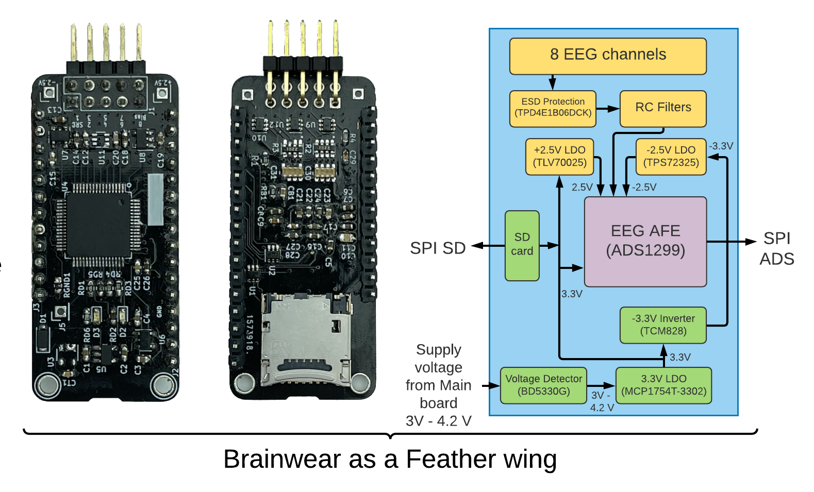

# Brainwear board

The Brainwear board is an open-source EEG sensing driver module is designed with the state-of-the-art analog front-end that is pin-compatible with the popular Feather ecosystem in the wearable and DIY community.

## Hardware description

The Brainwear board was made using the Texas Instruments Analog Front-End ADS1299. This SOC incorporates low-power technology and integrates instrumentation amplifiers, operational amplifiers, and analog to digital converters into a single IC. Hence, it is ideal for biopotential measurements such as EEG, ECG, and EOG as it provides eight different channels with a 24-bit resolution and a sampling rate of 250 Hz. Additionally, it includes attractive characteristics such as test signals for impedance measurement and SPI compatible interface.

The Brainwear board is a mixed-signal system that combines both analog and digital components. Since both components are present in a single circuit, the analog circuit is susceptible to crosstalk noise generated by the digital circuit via stray capacitances. As a result, the small EEG signals acquired by the AFE can easily be distorted and provide erroneous measurements. The crosstalk noise was avoided by using a fully isolated circuit design technique. That is, separated ground planes for digital and analog signals and isolated analog and digital interfaces at each side of the board. Moreover, we used Low-Dropout linear regulators (MCP1754T-3302, TPS72325, TLV70025) and a voltage inverter (TCM828) to provide the analog bipolar supply of +- 2.5V and the digital supply of + 3.3V. The control signals of these devices were also isolated from the ground planes to avoid the switching noise generated by the voltage inverter.  

The feather board powers the Brainwear board. Then, a voltage detection IC (BD5330G) is used to disconnect the circuit once the supply voltage is lower than 3V to protect the battery. The ADS1299 is connected in a referential montage. Thus, eight different channels can be measured in reference to the input SRB1. The AFE also offers the possibility of measuring the bias in the signals using the Bias input included in the PCB. Electrostatic discharge chips were included to protect the channels of the board as well as the main analog and digital signals in the circuit.
Additionally, an LED (GPIO4) was added to provide an easy way to test the SPI communication between the main board and the Brainwear module. Hardware filters were included following the references provided by Texas Instruments and OpenBCI. Finally, an SD module was integrated into the board in order to record EEG data when required. It is essential to mention that the ADS1299 and the SD card do not share the same SPI bus. Hence, the ADS1299 is connected to the predetermined SPI pins of the feather board, while the SD card requires configuring the board's upper pins to act as an SPI bus.

The KiCAD files with the PCB of the Brainwear board are in the folder Design Files

## Firmware description
The firmware shows an application example in the file Brainwear_test.ino. The program contains two different types of classes: the first one is used for instantiating the Brainwear board while the second allows to add the Mechanomyography sensors whose signals are acquired with the TI-ADS1015. The first class packages all the functionalities available in the Brainwear hardware, i.e. testing signals, register, channel, and sample rate configuration, among others. This code is based on the OpenBCI firmware for the Cyton board. On the other hand, the second class allows to instantiate one board of the ADS1015 according to the required sample rate and gain. It also includes functionalities to send data to the main board according to the type of transmissions.

The system receives commands via the serial port that allow to configure the way the board behaves. A description of the commands is given below. Further information about the commands can be found in the file Brainwear_definitions.h

### Commands
#### Multichar commands
1. Channel settings

This command requires multiple characters to be recognized. It consists of seven different settings group together corresponding to the channel to modify, power-down, gain, type of input, bias generation, connection to SRB2, connection to SRB1, respectively. The code starts with lower x and end with capital X.

Example:

    x1060001X

This code sets the channel (1) to power-down on (0), gain of 24 (6), normal input (0), remove bias (0), disconnected of SRB2 (0) and connected to SRB1 (1)

2. Leadoff settings

This command requires multiple characters to be recognized. It consists of 3 different settings group together corresponding to the channel to modify and the activation of the Lead off for the channel P and the channel N of the specified channel, respectively. The code starts with lower z and end with capital Z.

Example:

    z111Z

This code sets the Leadoff detection for the channel (1) to (1 / activated) for the P channel and to (1 / activated) for the N channel.

3. Sample rate settings
 
This command requires multiple characters to be recognized. It consists of the character ~ followed by the desired sample rate for the board. The options are shown below.

| Command | Sample Rate |
|---------|-------------|
| 0       | 16 KHz      |
| 1       | 8 KHz       |
| 2       | 4 KHz       |
| 3       | 2 KHz       |
| 4       | 1 KHz       |
| 5       | 500 Hz      |
| 6       | 250 Hz      |

Example:

    ~6

This code sets the sample rate of the board to 250 Hz.

#### Single commands

The single commands to manipulate the Brainwear board as described in the following table.

| Command | Description |
|---------|-------------|
| 1       | Deactivate channel 1      |
| 2       | Deactivate channel 2      |
| 3       | Deactivate channel 3      |
| 4       | Deactivate channel 4      |
| 5       | Deactivate channel 5      |
| 6       | Deactivate channel 6      |
| 7       | Deactivate channel 7      |
| 8       | Deactivate channel 8      |
| Q       | Activate channel 1        |
| W       | Activate channel 2        |
| E       | Activate channel 3        |
| R       | Activate channel 4        |
| T       | Activate channel 5        |
| Y       | Activate channel 6        |
| U       | Activate channel 7        |
| I       | Activate channel 8        |
| p       | Connect channels to DC Test signal      | 
| 0       | Connect channels to GND Test signal     | 
| =       | Connect channels to fast 1X Test signal | 
| -       | Connect channels to slow 1X signal      | 
| ]       | Connect channels to fast 2X Test signal | 
| \[      | Connect channels to slow 2X Test signal | 
| n       | Connect channels to normal input        | 
| d       | Set all channels to default settings      |
| D       | Report the default settings        |
| C       | Report number of channels in board      |
| t       | Activate serial stream of data       |
| y       | Deactivate serial stream of data       |
| b       | Start streaming data       |
| s       | Stop streaming data         |
| ?       | Show the register settings of the ADS1299 board       |
| v       | Soft reset of the board        |
| V       | Get firmware version        |
| l       | Turn on LED on the Brainwear board      |
| k       | Turn off LED on the Brainwear board      |
| a       | Activate recording with the SD card      |
| r       | Reset file counter for the SD files      |
| j       | Close SD file      |
| A       | Record 1 minute of activity in the SD      |
| S       | Record 5 minutes of activity in the SD       |
| F       | Record 15 minutes of activity in the SD      |
| G       | Record 30 minutes of activity in the SD         |
| H       | Record 1 hour of activity in the SD        |
| J       | Record 2 hours of activity in the SD        |
| K       | Record 4 hours of activity in the SD         |
| <       | Set transmission to RAW mode (compatible with OpenBCI)        |
| >       | Set transmission to ASCII mode (compatible with Arduino plotter)        |
| M       | Activate multimode (EEG + MMG)       |
| N       | Deactivate multimode  (Only EEG is active)       |
